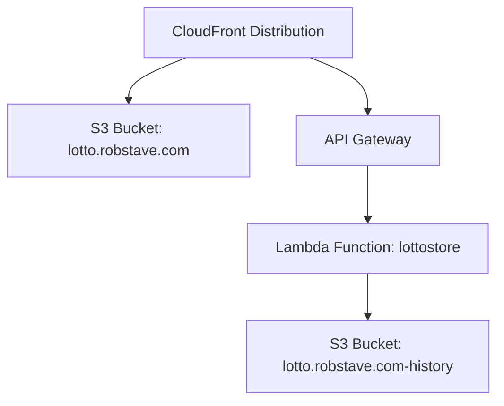

# lotto.robstave.com


Tiny static site that generates California SuperLotto Plus numbers with a bit of flair (sparkles, bouncing balls, and a very serious cat). The front-end assets live in the `frontend/` directory.

Preview (S3 object URL):
- https://s3.us-west-1.amazonaws.com/lotto.robstave.com/index.html
or
- lotto.robstave.com.s3-website-us-west-1.amazonaws.com


---


## Project overview

Consists of the following components:

- S3 bucket (`lotto.robstave.com`) to host the static site
- S3 bucket (`lotto.robstave.com-history`) to store generated numbers 
- Lambda function (`lottostore`) to fetch and store numbers in the history bucket
- API Gateway endpoint to invoke the Lambda function
- Cloudfront distribution to serve the API (optional; can serve directly from S3)


Create this as a mermaid diagram

cloudfront is connected to the s3 bucket lotto.robstave.com and the api gateway.
api gateway is connected to the lambda function lottostore.
lambda function lottostore is connected to the s3 bucket lotto.robstave.com-history



There is a usage plan on the API Gateway to limit requests to 100 per day. The API key is passed in the `x-api-key` header when invoking the API.


## Quick start (local)
- No build required. Open `frontend/index.html` directly in your browser.
- Optional: run a simple static server while editing to avoid caching quirks.

## Quick deploy to S3

Prereqs:
- AWS CLI installed and configured with an IAM user that can write to `s3://lotto.robstave.com`
- Bucket created; public-read/website or CloudFront configured

PowerShell (Windows):
```powershell
# From repository root
aws s3 sync frontend/ s3://lotto.robstave.com --delete
```

Bash (macOS/Linux):
```bash
aws s3 sync frontend/ s3://lotto.robstave.com --delete
```

Notes:
- `--delete` removes files in the bucket that no longer exist locally.
- If hosting directly from S3 (no CloudFront), ensure the bucket policy allows public reads for objects or adjust Public Access Blocks accordingly.

---

## GitHub Actions deploy (optional)
Create repository secrets (GitHub → Settings → Secrets and variables → Actions):
- `AWS_ACCESS_KEY_ID` — from an IAM user
- `AWS_SECRET_ACCESS_KEY` — from the same IAM user
- `AWS_REGION` — e.g. `us-west-1`
- `S3_BUCKET` — `lotto.robstave.com`

Example workflow (`.github/workflows/deploy.yml`):
```yaml
name: Deploy to S3
on:
  push:
    branches: [ main ]
    paths:
      - 'frontend/**'
jobs:
  deploy:
    runs-on: ubuntu-latest
    steps:
      - uses: actions/checkout@v4
      - uses: aws-actions/configure-aws-credentials@v4
        with:
          aws-access-key-id: ${{ secrets.AWS_ACCESS_KEY_ID }}
          aws-secret-access-key: ${{ secrets.AWS_SECRET_ACCESS_KEY }}
          aws-region: ${{ secrets.AWS_REGION }}
      - name: Sync to S3
        run: |
          aws s3 sync frontend/ s3://${{ secrets.S3_BUCKET }} --delete
```
Tip: Consider GitHub OIDC with a role in AWS for short-lived credentials instead of long-lived access keys.

---

## Minimal IAM policy for deploy user
Attach something like this to the IAM user/role used by CI or local deploys (adjust bucket name/region as needed):

```json
{
  "Version": "2012-10-17",
  "Statement": [
    {
      "Effect": "Allow",
      "Action": ["s3:ListBucket"],
      "Resource": "arn:aws:s3:::lotto.robstave.com"
    },
    {
      "Effect": "Allow",
      "Action": ["s3:PutObject", "s3:DeleteObject", "s3:PutObjectAcl"],
      "Resource": "arn:aws:s3:::lotto.robstave.com/*"
    }
  ]
}
```

---

## Mystic circle diagram
The main demo (`index.html`) renders a star‑polygon chord diagram beneath the generated numbers.
